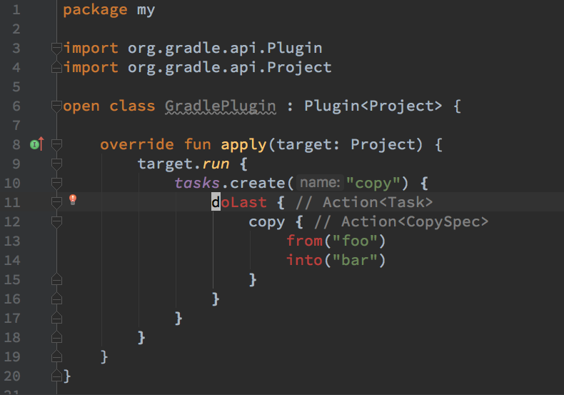

# minimal-sam-with-receiver-repro

A minimal Gradle Kotlin DSL project using the sam-with-receiver plugin.

Notice it compiles cleanly from the command line:

    ./gradlew assemble

But IntelliJ IDEA still doesn't enable the _sam-with-receiver_
behaviour for `Action<T>` blocks:

